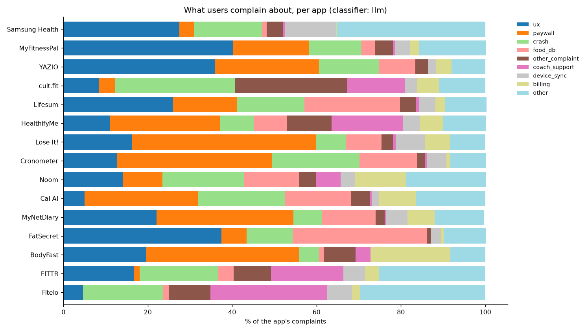
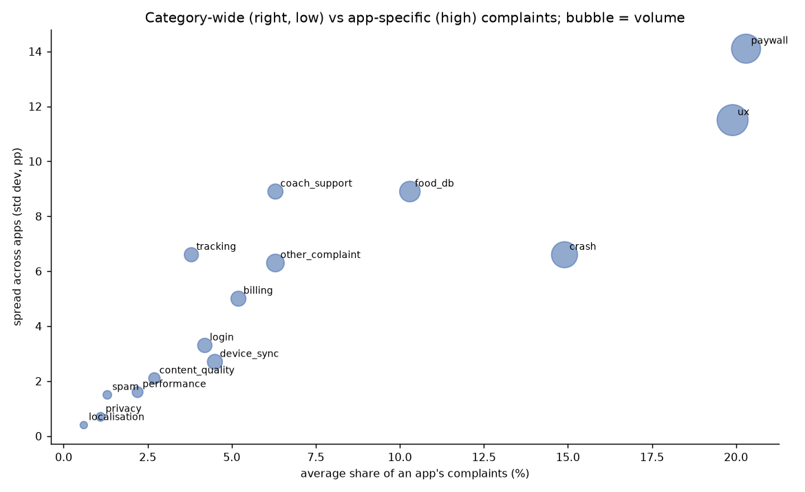
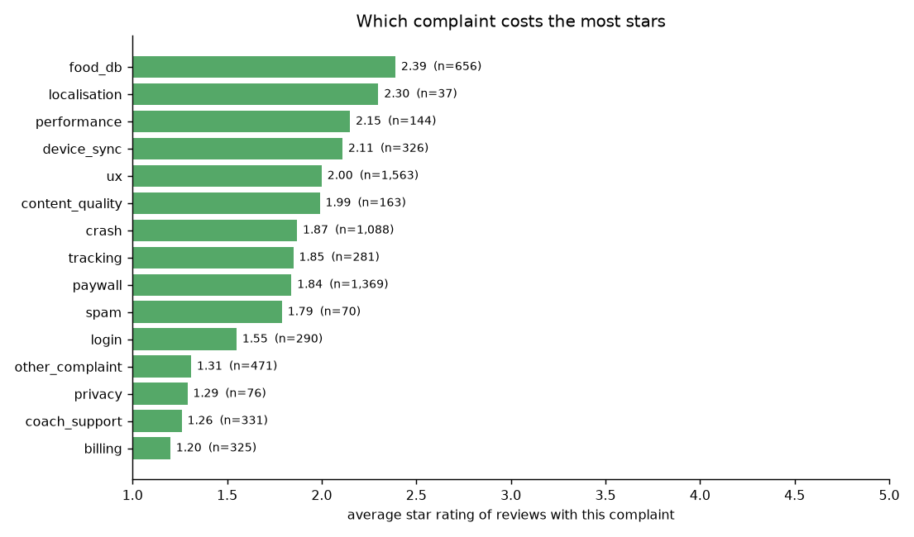
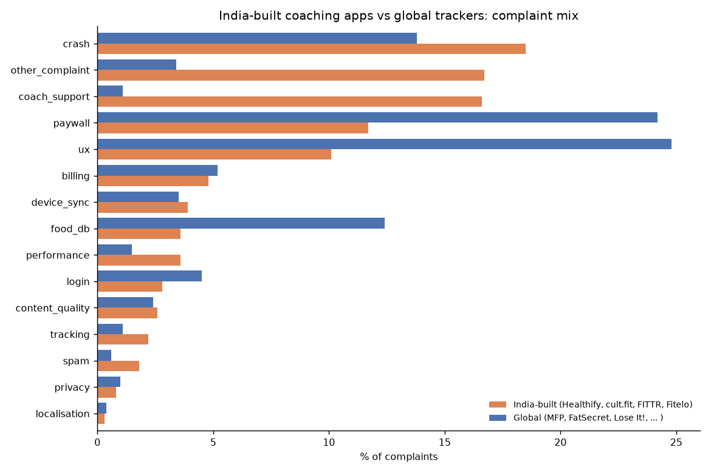
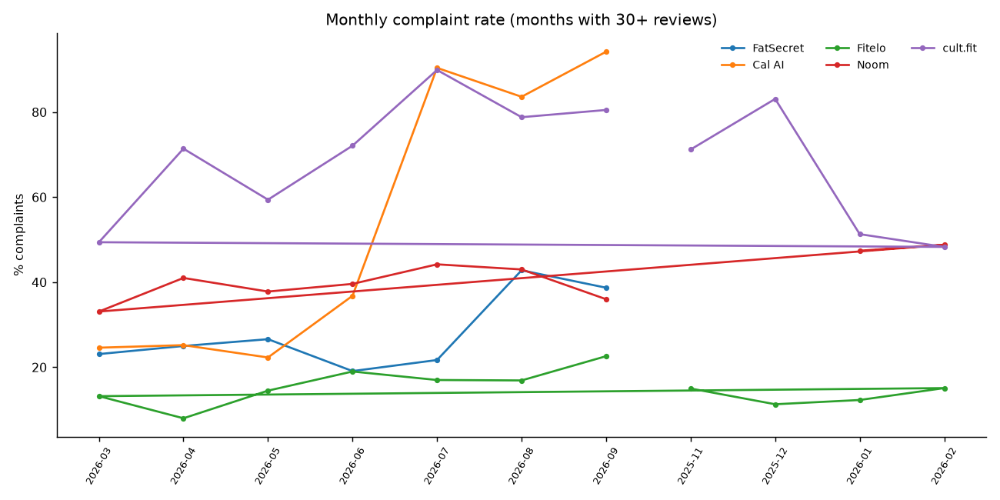

# What 120,000 Indian users complain about in health & nutrition apps

15 apps, 119,266 text reviews from the India Play Store (newest 8,000 per app, scraped
2 October 2026). The newest 1,000 reviews per app (15,000) were classified by an LLM into a
16-label complaint taxonomy; the full set carries a keyword baseline. Both classifiers were
scored against 300 independently annotated reviews before any number below was written.
Method, taxonomy and limits are in the [README](../README.md); every table comes from a
query in `sql/`, logged verbatim in `query_log.md`.

> **Classifier validation** (`validation_report.md`, 300 reviews, 20 per app):
> LLM classifier **93.3% accuracy, Cohen's κ 0.92**, complaint-vs-praise 97.7%.
> Keyword baseline 51.7%, κ 0.45. The reference labels were annotated by a different model
> (Claude Fable) one review at a time, not by the batch classifier (Claude Sonnet); a human
> spot-check of 50 rows is the remaining step and disagreements will be published as-is.
> The baseline was not just less accurate, it told a different story: on keyword labels the
> top complaint looked like the food database (precision 0.25 on that label); on validated
> labels it is the redesign. That gap is the reason the validation step exists.

## The one finding

**The biggest complaint in the category is self-inflicted: redesigns.** UX is the #1
complaint across the 15 apps (22% of all complaints, top-3 in 11 of 15 apps) and the one
users agree on most: UX reviews collect 23% of every "helpful" vote in the set, almost as
many as all praise combined (25%), with 2.5 votes per review against 1.6 for paywall and
crash complaints. And 44% of UX complaints explicitly blame an update, against 2% for
paywall and 6% for food-database complaints. This is not "the app is confusing"; it is
"the app was fine and you changed it".

| App | UX share of complaints | UX reviews that blame an update |
|---|---|---|
| MyFitnessPal | 40% | 85% |
| FatSecret | 38% | 65% |
| YAZIO | 36% | 15% |
| Samsung Health | 28% | 72% |
| Lifesum | 26% | 52% |
| MyNetDiary | 22% | 12% |

Four apps shipped a redesign in the window and all four show the same signature:

- **MyFitnessPal** (new layout, spring 2026): 40% of its complaints are UX, 85% of them
  name the update, 41% of all its complaints mention an update; the most-upvoted review in
  the set reads the change as a nudge toward premium.
- **FatSecret 11.8.0.5** (new food-logging UI, first seen 27 Aug 2026): in the 30 days
  after vs the 30 before, the complaint rate went from 24% to 54%, average rating from
  4.28 to 3.28, UX share from 6% to 35%, and 37% of post-release reviews blamed the
  update. The follow-up 11.8.0.6 (12 Sep) pulled the complaint rate back to 29% and the
  rating to 4.5: a reverted or repaired redesign shows up within two weeks.
- **Samsung Health 7.00.6** (new home screen, Sep 2026): 72% of its UX complaints cite the
  update; 38% of all its complaints mention an update.
- **Lifesum** (new design plus AI-first logging): 52% of UX complaints cite the update.

The common thread in the text: a feature or layout people used daily was moved, hidden
or replaced (meal copy, "done logging", quick add, dashboard widgets, the old diary), and
the change was read as a push toward premium. YAZIO is the exception that proves the
rule: its 36% UX share is onboarding friction (endless questionnaires, spin-the-wheel
animations), not a single release, which is why only 15% cite an update.

## Four more things the data says

**"Not free" is the second complaint, and it is an onboarding problem more than a pricing
one.** Paywall is 19% of complaints (top-3 in 8 of 15 apps): Lose It! 44%, Cronometer 37%,
BodyFast 36%, MyNetDiary 32%, Cal AI 27%, HealthifyMe 26%. The dominant text pattern is
"filled in the whole questionnaire, then hit the price screen" and "says free, isn't".
Showing the price before the setup flow is a copy change, not a pricing change.

**Global apps lose Indian users on redesigns and price; Indian apps lose them on service.**
India-built coaching apps (HealthifyMe, FITTR, Fitelo, cult.fit) vs global trackers:
coach/support 17% vs 1%, UX 10% vs 25%, paywall 12% vs 24%, food database 4% vs 12%,
crashes 19% vs 14%. Fitelo's complaints are 28% coach quality (dietitians changing,
no follow-up calls) and HealthifyMe's 17% (coaches pushing plan extensions). The Indian
apps sell a human; the human is what gets reviewed.

**The food database is unsolved, and it is a tracker problem, not a category problem.**
9% of all complaints, but 32% at FatSecret, 23% at Lifesum, 16% at Cal AI (the AI-photo
app built to replace the database), 14% at Cronometer, 13% at Noom and MyNetDiary.
It never reaches the top 3 at the coaching apps, where a human writes the plan. This
is the complaint the keyword baseline over-counted; the validated share is a quarter of
what it looked like, and it is still the fourth-largest bucket.

**Billing and support complaints are small but lethal.** Billing is 4.5% of complaints
but 88% of them are 1-star (average rating 1.20, the lowest of any label); coach/support
is 86% 1-star (1.26). UX complaints, for all their volume, average 2.0 stars and are
only 48% 1-star. A redesign costs you ratings broadly; a billing failure costs you the
customer.

**Releases cut both ways, and the fixes are invisible.** The five releases that reduced
complaints most (HealthifyMe v30.8, YAZIO 26.35.0 and 12.87.0, Noom 14.6.0, FatSecret
11.8.0.6) dropped the complaint rate by 20 to 65 points and lifted ratings by 0.7 to 2.1
stars within 30 days, and almost nobody wrote "thanks for the update". Users write when
things break; the before/after query is the only place the fixes show up.

## What a PM at one of these apps could do with this

- **Anyone planning a redesign:** the FatSecret 11.8.0.5 → 11.8.0.6 pair is the cleanest
  natural experiment in the set: 30 points of complaint rate in two weeks, then back.
  Ship layout changes behind a "use the old layout" switch and watch `mentions_update`
  share, not just star rating; the rating lags, the blame does not.
- **Global trackers (MyFitnessPal, Lose It!, Lifesum, FatSecret):** two fixes cover half
  of the complaints: show the price before the questionnaire, and keep the diary flow
  stable. The Indian-food database gap (`sql/01`, label `food_db`) is third.
- **Indian coaching apps (HealthifyMe, Fitelo, FITTR):** coach responsiveness is the
  product. Fitelo's 28% coach share is a capacity or SLA problem, not an app problem;
  HealthifyMe's upsell-pressure reviews are a sales-incentive problem.
- **Samsung Health:** tracking (24%) plus device sync (12%) plus UX (28%) means the
  watch-plus-app system is being reviewed as one product; the app takes the blame for
  the hardware.

## Limits worth repeating

Play Store text reviews over-represent angry users; this is the mix among complainers,
not among users. LLM labels cover the newest 1,000 reviews per app, so the window differs
by app (MyFitnessPal and Samsung Health: the last 10 months; Fitelo and FITTR: several
years); the before/after release table uses only labelled reviews and keeps versions with
50+ reviews on both sides. The release date is a proxy (first review seen on a version).
The reference labels for validation are model annotations, not human ones, until the
spot-check is done. The `country=in` scrape still returns some non-Indian, non-English
reviews; the language split query shows how many (fewer than 1% Hindi or Hinglish by the
heuristic, so the language comparison is not yet meaningful).

<!-- data:start -->

_Generated by src/report.py. Classifier: **llm**. Reviews: **15,000** across 15 apps; complaints: **7,190** (48%)._

### Complaint rate and top 3 complaints per app

| app | segment | reviews | complaint % | avg stars | top_3_complaints |
|---|---|---|---|---|---|
| Samsung Health | platform | 1000 | 79.6 | 2.2 | ux 28%, tracking 24%, crash 16% |
| MyFitnessPal | global_tracker | 1000 | 75.0 | 2.6 | ux 40%, paywall 18%, crash 12% |
| YAZIO | global_tracker | 1000 | 69.7 | 2.7 | ux 36%, paywall 25%, crash 14% |
| cult.fit | india_fitness | 1000 | 66.3 | 2.5 | crash 28%, other_complaint 26%, coach_support 14% |
| Lifesum | global_tracker | 1000 | 66.2 | 2.9 | ux 26%, food_db 23%, crash 16% |
| HealthifyMe | india_coach | 1000 | 62.9 | 2.7 | paywall 26%, coach_support 17%, ux 11% |
| Lose It! | global_tracker | 1000 | 52.1 | 3.3 | paywall 44%, ux 16%, food_db 8% |
| Cronometer | global_tracker | 1000 | 43.9 | 3.8 | paywall 37%, crash 21%, food_db 14% |
| Noom | global_coach | 1000 | 41.7 | 3.8 | crash 19%, ux 14%, food_db 13% |
| Cal AI | ai_photo | 1000 | 37.9 | 3.5 | paywall 27%, crash 21%, food_db 16% |
| MyNetDiary | global_tracker | 1000 | 31.2 | 4.1 | paywall 32%, ux 22%, food_db 13% |
| FatSecret | global_tracker | 1000 | 30.4 | 4.1 | ux 38%, food_db 32%, crash 11% |
| BodyFast | fasting | 1000 | 25.4 | 4.0 | paywall 36%, ux 20%, billing 19% |
| FITTR | india_coach | 1000 | 21.5 | 4.3 | crash 19%, coach_support 17%, ux 17% |
| Fitelo | india_coach | 1000 | 15.2 | 4.3 | coach_support 28%, crash 19%, other_complaint 10%, tracking 10% |

### Category-wide vs app-specific

`apps_where_top3` = number of the 15 apps where this is a top-3 complaint. A high average share with low spread is a category problem; a high max with high spread is one app's problem.

| label | n | % of all | apps_where_top3 | avg share | min | max | spread | worst_app |
|---|---|---|---|---|---|---|---|---|
| ux | 1,563.0 | 21.7 | 11.0 | 19.9 | 4.6 | 40.3 | 11.5 | MyFitnessPal |
| paywall | 1,369.0 | 19.0 | 8.0 | 20.3 | 1.4 | 43.6 | 14.1 | Lose It! |
| crash | 1,088.0 | 15.1 | 11.0 | 14.9 | 4.7 | 28.4 | 6.6 | cult.fit |
| food_db | 656.0 | 9.1 | 7.0 | 10.3 | 1.0 | 31.9 | 8.9 | FatSecret |
| other_complaint | 471.0 | 6.6 | 2.0 | 6.3 | 1.0 | 26.5 | 6.3 | cult.fit |
| coach_support | 331.0 | 4.6 | 4.0 | 6.3 | 0.1 | 27.6 | 8.9 | Fitelo |
| device_sync | 326.0 | 4.5 | 0.0 | 4.5 | 1.8 | 12.2 | 2.7 | Samsung Health |
| billing | 325.0 | 4.5 | 1.0 | 5.2 | 0.1 | 18.9 | 5.0 | BodyFast |
| login | 290.0 | 4.0 | 0.0 | 4.2 | 1.2 | 12.0 | 3.3 | MyFitnessPal |
| tracking | 281.0 | 3.9 | 2.0 | 3.8 | 0.3 | 24.2 | 6.6 | Samsung Health |
| content_quality | 163.0 | 2.3 | 0.0 | 2.7 | 0.1 | 7.2 | 2.1 | Fitelo |
| performance | 144.0 | 2.0 | 0.0 | 2.2 | 0.4 | 5.6 | 1.6 | cult.fit |
| privacy | 76.0 | 1.1 | 0.0 | 1.1 | 0.3 | 2.6 | 0.7 | FatSecret |
| spam | 70.0 | 1.0 | 0.0 | 1.3 | 0.2 | 5.9 | 1.5 | Fitelo |
| localisation | 37.0 | 0.5 | 0.0 | 0.6 | 0.2 | 1.4 | 0.4 | Samsung Health |

### Which complaint costs the most stars, and which gets upvoted

| label | n | avg stars | % 1-star | avg helpful votes | % of all votes | % blame an update |
|---|---|---|---|---|---|---|
| billing | 325 | 1.2 | 87.7 | 1.5 | 2.8 | 0.0 |
| coach_support | 331 | 1.3 | 85.8 | 2.6 | 5.0 | 0.0 |
| privacy | 76 | 1.3 | 85.5 | 1.1 | 0.5 | 1.3 |
| other_complaint | 471 | 1.3 | 82.4 | 1.1 | 2.9 | 8.1 |
| login | 290 | 1.6 | 69.7 | 0.8 | 1.4 | 8.3 |
| spam | 70 | 1.8 | 61.4 | 1.6 | 0.6 | 4.3 |
| paywall | 1369 | 1.8 | 58.6 | 1.6 | 12.9 | 2.0 |
| tracking | 281 | 1.9 | 50.5 | 1.5 | 2.4 | 20.6 |
| crash | 1088 | 1.9 | 54.1 | 1.6 | 10.2 | 13.8 |
| content_quality | 163 | 2.0 | 49.7 | 1.5 | 1.4 | 1.2 |
| ux | 1563 | 2.0 | 47.7 | 2.5 | 22.7 | 44.1 |
| device_sync | 326 | 2.1 | 46.0 | 1.1 | 2.2 | 11.7 |
| performance | 144 | 2.1 | 38.2 | 3.5 | 2.9 | 19.4 |
| localisation | 37 | 2.3 | 45.9 | 0.7 | 0.2 | 5.4 |
| food_db | 656 | 2.4 | 35.1 | 1.7 | 6.5 | 5.9 |

### India-built coaching apps vs global trackers

| label | India-built % | global % | Samsung Health % | diff (pp) |
|---|---|---|---|---|
| coach_support | 16.6 | 1.1 | 0.4 | 15.5 |
| ux | 10.1 | 24.8 | 27.5 | -14.7 |
| other_complaint | 16.7 | 3.4 | 3.9 | 13.3 |
| paywall | 11.7 | 24.2 | 3.5 | -12.5 |
| food_db | 3.6 | 12.4 | 1.0 | -8.9 |
| crash | 18.5 | 13.8 | 16.2 | 4.7 |
| performance | 3.6 | 1.5 | 1.6 | 2.0 |
| login | 2.8 | 4.5 | 4.0 | -1.6 |
| spam | 1.8 | 0.6 | 1.3 | 1.2 |
| tracking | 2.2 | 1.1 | 24.2 | 1.2 |
| device_sync | 3.9 | 3.5 | 12.2 | 0.5 |
| billing | 4.8 | 5.2 | 0.1 | -0.4 |
| content_quality | 2.6 | 2.4 | 0.8 | 0.2 |
| privacy | 0.8 | 1.0 | 1.9 | -0.2 |
| localisation | 0.3 | 0.4 | 1.4 | -0.1 |

### Releases that moved the needle (30 days before vs after first sighting of a version)

Release date is a proxy (first review on that version). Positive `complaint_delta_pp` = complaints rose after the release.

| app | app_version | first seen | n_before | n_after | rating_before | rating_after | complaint Δpp | crash Δpp | % blame update |
|---|---|---|---|---|---|---|---|---|---|
| FatSecret | 11.8.0.5 | 2026-08-27 | 138 | 154 | 4.3 | 3.3 | 30.0 | -2.0 | 37.0 |
| BodyFast | 3.49.4 | 2025-09-03 | 72 | 63 | 4.5 | 4.1 | 12.7 | 0.0 | 0.0 |
| Cronometer | 4.58.0 | 2026-08-17 | 281 | 69 | 4.0 | 3.8 | 9.0 | 4.8 | 1.4 |
| Fitelo | 2.2.77 | 2026-05-20 | 69 | 70 | 4.6 | 4.3 | 8.4 | 4.3 | 0.0 |
| FatSecret | 11.3.0.1 | 2026-04-27 | 128 | 60 | 4.4 | 4.0 | 7.5 | -1.4 | 5.0 |
| Cronometer | 4.58.1 | 2026-08-20 | 271 | 57 | 4.0 | 3.7 | 6.9 | 6.8 | 1.8 |
| Samsung Health | 7.00.6.011 | 2026-09-07 | 467 | 363 | 2.3 | 2.1 | 6.9 | 3.5 | 27.5 |
| Fitelo | 2.2.62 | 2025-12-09 | 145 | 65 | 4.5 | 4.3 | 6.6 | 4.3 | 1.5 |
| Cronometer | 4.59.1 | 2026-09-18 | 293 | 56 | 3.7 | 3.7 | 2.5 | 10.7 | 7.1 |
| MyNetDiary | 9.7.8 | 2026-06-22 | 93 | 184 | 4.0 | 4.2 | 2.5 | -2.1 | 1.1 |
| FatSecret | 11.7.0.1 | 2026-08-07 | 127 | 74 | 4.3 | 4.3 | 2.3 | -0.6 | 2.7 |
| Cronometer | 4.57.0 | 2026-06-25 | 77 | 193 | 4.0 | 3.9 | 2.2 | 3.9 | 6.7 |

Releases that *reduced* complaints most:

| app | app_version | release_proxy_date | complaint_pct_before | complaint_pct_after | complaint_delta_pp |
|---|---|---|---|---|---|
| HealthifyMe | v30.8 | 2026-07-09 | 84.3 | 19.4 | -64.9 |
| YAZIO | 26.35.0 | 2026-09-01 | 71.9 | 34.5 | -37.4 |
| YAZIO | 12.87.0 | 2026-06-01 | 81.0 | 56.6 | -24.4 |
| Noom | 14.6.0 | 2026-03-02 | 46.7 | 26.2 | -20.5 |
| FatSecret | 11.8.0.6 | 2026-09-12 | 49.5 | 29.3 | -20.2 |

### Language split

| lang_hint | n_reviews | avg_rating | complaint_pct | label | share_of_complaints_pct |
|---|---|---|---|---|---|
| en | 14935 | 3.4 | 47.9 | ux | 21.8 |
| en | 14935 | 3.4 | 47.9 | paywall | 19.0 |
| en | 14935 | 3.4 | 47.9 | crash | 15.2 |
| en | 14935 | 3.4 | 47.9 | food_db | 9.1 |
| en | 14935 | 3.4 | 47.9 | other_complaint | 6.5 |
| hi | 8 | 3.1 | 50.0 | tracking | 25.0 |
| hi | 8 | 3.1 | 50.0 | other_complaint | 25.0 |
| hi | 8 | 3.1 | 50.0 | paywall | 25.0 |
| hi | 8 | 3.1 | 50.0 | login | 25.0 |
| hinglish | 57 | 3.1 | 52.6 | paywall | 26.7 |
| hinglish | 57 | 3.1 | 52.6 | other_complaint | 16.7 |
| hinglish | 57 | 3.1 | 52.6 | coach_support | 10.0 |
| hinglish | 57 | 3.1 | 52.6 | food_db | 10.0 |
| hinglish | 57 | 3.1 | 52.6 | device_sync | 10.0 |

<!-- data:end -->
